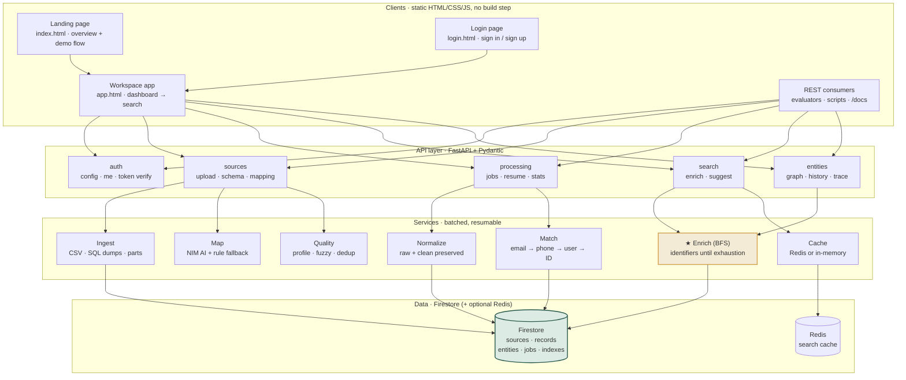

# Architecture Documentation

## Overview

The Entity Resolution Platform implements **Progressive Entity Enrichment** - the core capability where a record found using one identifier reveals additional identifiers, which are then used to discover more records across other datasets until the entity is fully enriched.

## Architecture Diagram (Mermaid)

Renders automatically on GitHub and in the video walkthrough.



## Progressive Enrichment Flow (Mermaid)


## System Architecture

```
┌──────────────────────┐
│   HTML/CSS/JS UI     │
│                      │
│ Dashboard            │
│ Sources              │
│ Mapping              │
│ Search               │
│ Entity Details       │
└──────────┬───────────┘
           │ REST
           ▼
┌──────────────────────┐
│       FastAPI        │
│                      │
│ Source API           │
│ Mapping API          │
│ Processing API       │
│ Search API           │
│ Entity API           │
└──────────┬───────────┘
           │
   ┌───────┼───────┐
   ▼       ▼       ▼
┌──────┐ ┌──────┐ ┌────────┐
│Ingest│ │Match │ │ NIM    │
│+Clean│ │+Enrich│ │Service │
└──┬───┘ └──┬───┘ └────┬───┘
   │        │         │
   ▼        ▼         ▼
┌────────────────────────────────┐
│       Firebase / Firestore     │
│                                │
│ Sources                        │
│ Records / Indexes              │
│ Master Entities                │
│ Provenance                     │
│ Processing Jobs                │
└────────────────────────────────┘
```

## Core Components

### 1. Ingestion Pipeline (`services/ingestion.py`)

- **Batch-oriented**: Processes CSV in chunks of `BATCH_SIZE=1000`
- **Streaming**: Never loads entire dataset into memory
- **Validation**: File type, size, encoding validation
- **Schema Inspection**: Automatic column detection and type inference

### 2. Field Mapping (`services/mapping.py` + `services/nim.py`)

- **Two-tier approach**:
  1. NVIDIA NIM (AI) for intelligent mapping
  2. Deterministic rule-based fallback
- **User Review Required**: Mappings must be confirmed before processing
- **Canonical Fields**: email, phone, username, member_id, name, address, company

### 3. Normalization (`services/normalization.py`)

Preserves both original and normalized values for traceability:

| Field | Example |
|-------|---------|
| email | `" John@Example.COM "` → `"john@example.com"` |
| phone | `"+91 98765-43210"` → `"+919876543210"` |
| name | `"john doe"` → `"John Doe"` |

### 4. Indexing (`services/matching.py`)

In-memory lookup indexes for MVP (designed for persistence swap):

```
email_index:     { "john@example.com": {rec_1, rec_5, ...} }
phone_index:     { "+919876543210": {rec_1, rec_12, ...} }
username_index:  { "johndoe": {rec_3, rec_7, ...} }
member_id_index: { "MEM1042": {rec_4, ...} }
```

### 5. Matching Engine (`services/matching.py`)

Configurable exact-match rules (priority order):

1. Exact email
2. Exact normalized phone
3. Exact username
4. Exact member_id

### 6. Progressive Enrichment (`services/enrichment.py`) - **CORE**

BFS-style traversal algorithm:

```python
queue = [(initial_identifier, identifier_type)]
visited = set()
matched_records = []

while queue:
    identifier, id_type = queue.pop(0)
    if (identifier, id_type) in visited: continue
    visited.add((identifier, id_type))
    
    records = matching_service.find(identifier, id_type)
    for record in records:
        matched_records.add(record)
        for new_id_type, new_id_value in extract_identifiers(record):
            if (new_id_value, new_id_type) not in visited:
                queue.append((new_id_value, new_id_type))

return build_master_entity(matched_records)
```

**Key Properties:**
- Dynamic discovery (not fixed steps)
- Continues until no new identifiers found
- Tracks enrichment path for UI visualization
- Prevents duplicate entity creation

### 7. Master Entity (`services/enrichment.py::build_master_entity`)

- Merges records by deterministic entity ID (hash of primary identifier)
- Field-level provenance tracking
- Source traceability for every field
- Deduplication across datasets

### 8. Search API (`api/search.py`)

- Normalizes query
- Identifies identifier type
- Triggers progressive enrichment
- Returns entity-oriented results with:
  - Master entity
  - Contributing sources
  - Enrichment path steps

## Data Models

### Source
```python
source_id, name, filename, type, status,
total_records, processed_records, matched_records,
new_entities, enriched_entities, created_at, updated_at
```

### Record
```python
record_id, source_id, source_row_id,
raw_data: Dict, normalized_data: Dict[field, NormalizedValue]
```

### NormalizedValue
```python
original_value, normalized_value, field_type
```

### Entity
```python
entity_id, name, email, phone, username, member_id, address, company,
source_ids, record_ids, created_at, updated_at
```

### EntityField (Provenance)
```python
value, source_id, source_record_id, source_field,
original_value, confidence
```

## Firebase Collections

| Collection | Purpose |
|------------|---------|
| `sources` | Source metadata & status |
| `records` | Individual normalized records |
| `entities` | Master entities with provenance |
| `processing_jobs` | Background job tracking |
| `indexes` | Persisted lookup indexes |

## Batch Processing Strategy

- **Configurable batch size**: `BATCH_SIZE = 1000`
- **Firestore batch writes**: Atomic commits per batch
- **Progress tracking**: Real-time updates via processing_jobs
- **Background tasks**: FastAPI `BackgroundTasks` (no Celery needed for MVP)

## NVIDIA NIM Integration

- **Server-side only**: API key never leaves backend
- **Service isolation**: Only `services/nim.py` communicates with NIM
- **Graceful degradation**: Rule-based mapping if NIM unavailable
- **Structured output**: Validated JSON response parsing

## Security

- Environment variables for all secrets
- `.env` in `.gitignore`
- Strict CORS (localhost only by default)
- Request validation via Pydantic
- File upload validation (type, size, encoding)
- Sanitized error responses
- No credentials in frontend or logs

## Scalability Considerations

| Current (MVP) | Production Ready |
|---------------|------------------|
| In-memory indexes | Firestore composite indexes / ElasticSearch |
| BackgroundTasks | Celery + Redis |
| Single-process | Horizontal scaling with load balancer |
| Local file upload | Cloud Storage (GCS/S3) + signed URLs |
| Demo datasets | Partitioned collections by source_id |

## Demo Data Flow

```
database_a.csv (email, full_name, mobile_number)
    │
    ├─► Upload → Schema → Mapping → Process
    │
    ▼
Records indexed by: email, phone
    │
    ▼
Search "john@example.com"
    │
    ├─► Email index → Database A record
    │       └─► Extract phone: 9876543210
    │
    ├─► Phone index → Database B record (address: Mumbai)
    │       └─► Extract username: johndoe
    │
    ├─► Username index → Database C record (company: ABC Pvt Ltd)
    │       └─► Extract member_id: MEM1042
    │
    ├─► Member_id index → Database D record
    │
    ▼
Master Entity: John Doe (7 fields, 4 sources)
```

## Testing Checkpoints

1. **Health**: `GET /health` → `{"status": "ok"}`
2. **Upload**: CSV → schema inspection → columns detected
3. **Mapping**: AI suggestions → user review → confirm
4. **Processing**: Background job → records indexed
5. **Enrichment**: `john@example.com` → full entity with 4 sources
6. **Traceability**: Each field shows source + original value
7. **Frontend**: All 4 screens functional
8. **E2E**: Complete demo scenario works